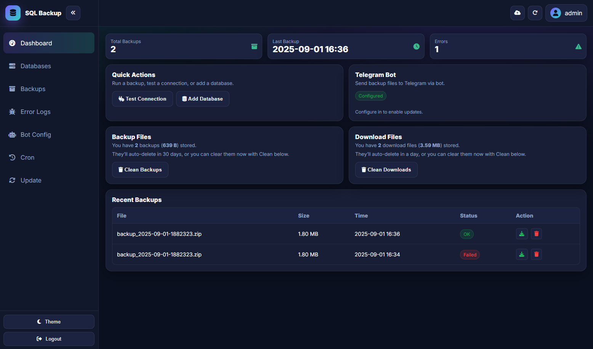

# 📦 SQL Backup

**One simple PHP file sets up your backup dashboard with DB export, ZIP, Telegram upload, and logs.**  
Encrypted configs, ZIP compression, Telegram uploads, and a clean dark dashboard UI.

---

## ✨ Features

- 🔒 Encrypted config files (`.sap`) keep credentials secure  
- 💾 Automated MySQL dump & ZIP packaging  
- 📤 Split & upload large backups directly to Telegram  
- 📊 Dashboard with logs, download manager, & cleanup tools  
- 🗄️ Multi-database support  
- 📱 Responsive dark UI for desktop & mobile  

---

## ⚙️ Requirements

- **PHP 7.4+**  
- Extensions: `mysqli`, `openssl`, `zip`, `curl`, `fileinfo`  
- Writable folder: `.sql-backup/`  
- Internet access for Telegram API  

---

## 🚀 Installation

1. **Download installer**

   - Download [`sql-backup.php`](https://raw.githubusercontent.com/samiulalim1/sql-backup/refs/heads/main/src/installer/main.php)
   - Or use the [Download Page](https://samiulalim1.github.io/sql-backup/)

2. **Upload to your server**

   Place `sql-backup.php` in your web root (same folder where you want `.sql-backup` folder).

3. **Run installer**

   Visit:  `https://yourdomain.com/sql-backup.php`

  - Step 1: Requirements check ✅  
  - Step 2: Create admin user & password  
  - Step 3: Installer sets up `.sql-backup/` and dashboard  

4. **Login**

After installation, Reload the page & login to dashboard.

---

## 📷 Screenshots

---

## 📜 License

MIT © 2025 – SQL Backup

